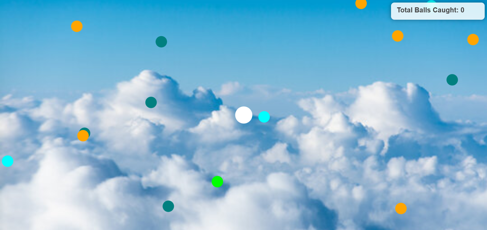
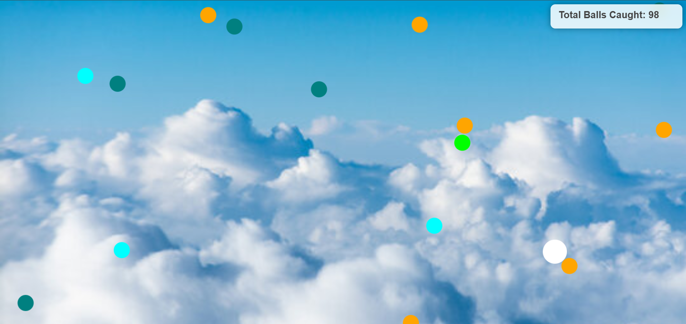

# Bouncing Balls with Catching Cursor

This project is a fun interactive game where balls bounce around the screen, and the user's cursor acts as a "catcher." When the cursor touches a ball, it gets caught, and the total count updates in real-time.

## Features
- Randomly moving bouncing balls.
- Catch balls using your cursor.
- Tracks the total number of balls caught.
- Fully responsive and adjusts to the screen size.
- Customizable settings for the number of balls, ball colors, and cursor radius.

## Endless Gameplay

### How it Works
This game features **endless gameplay**, where the player continuously tries to catch bouncing balls using the cursor. Each time a ball is caught, the total count increases, and the ball respawns at a random position on the canvas.

- **Catch Balls**: As the balls bounce around, move your mouse over them to catch them. Every successful catch will increase your total score.
- **Ball Respawn**: When a ball is caught, it respawns at a random position with random movement direction and speed, ensuring the game never ends.
- **No Time Limit**: There is no time limit in the game, so you can keep playing as long as you want.

### Game Features
- **Endless Loop**: The balls keep respawning after being caught, allowing for continuous gameplay.
- **Dynamic Difficulty**: With each new ball catch, the random movement speeds create unpredictable challenges, keeping the game exciting.
- **Interactive Interface**: The cursor, which acts as the "catcher," is the player's main control, making it easy to play without complex controls.

### Score Tracking
- The game displays the total number of balls caught at the top-right corner of the screen.
- You can monitor your progress as you continue catching more balls.

Feel free to try to catch as many balls as possible and challenge your friends to beat your score!


## Installation
1. Clone or download the repository.
2. Ensure the following files are present in the project directory:
   - `index.html` (Main HTML file)
   - `script.js` (JavaScript logic)
   - `image1.png` (Background image, optional)
3. Open the `index.html` file in any modern web browser to play.

## Screenshots

### Game Screen




### Total Caught Display


## Customization

### Adjust the Number of Balls
In the `init` function in `script.js`:
```javascript
for (let i = 0; i < 15; i++) { ... }
```
Change `15` to the desired number of balls.

### Change Ball Colors
Modify the `colors` array in `script.js`:
```javascript
let colors = ['orange', 'cyan', 'lime', 'pink', 'teal'];
```
Add or replace the colors in this array with your preferred colors.

### Alter Cursor Radius
Change the value of `cursorRadius` in `script.js`:
```javascript
let cursorRadius = 30;
```
Set it to your desired cursor size.

## License
Feel free to use and modify this project for personal or educational purposes.
